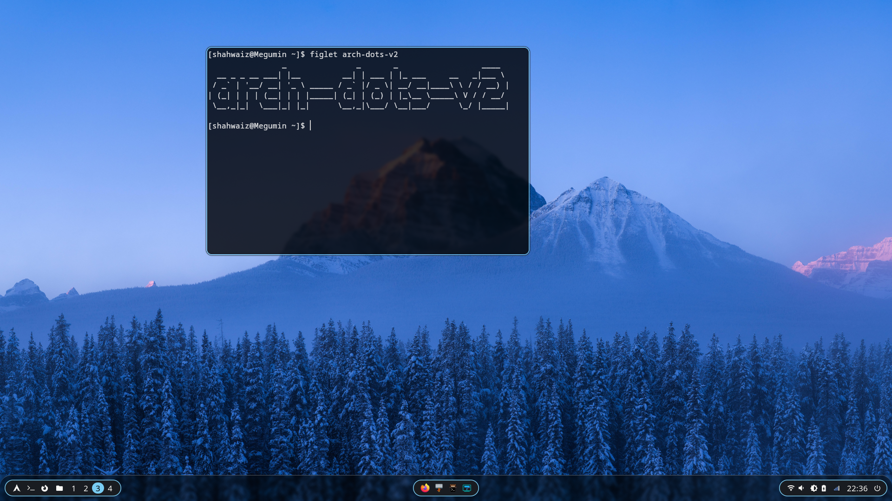
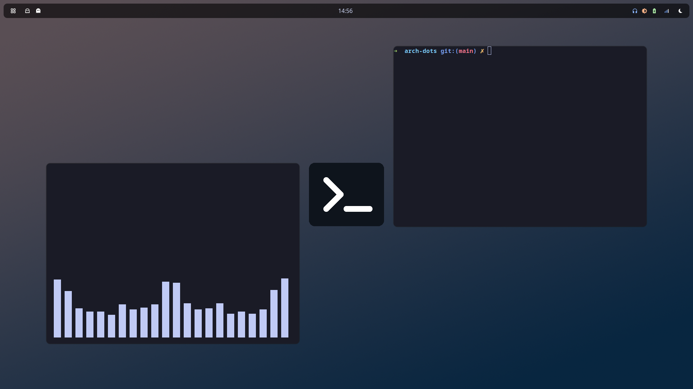
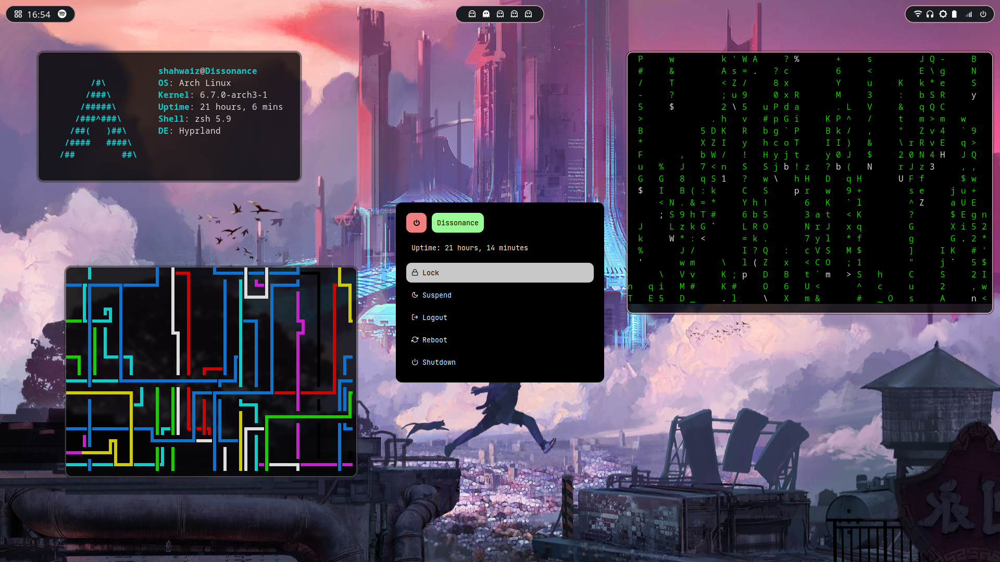
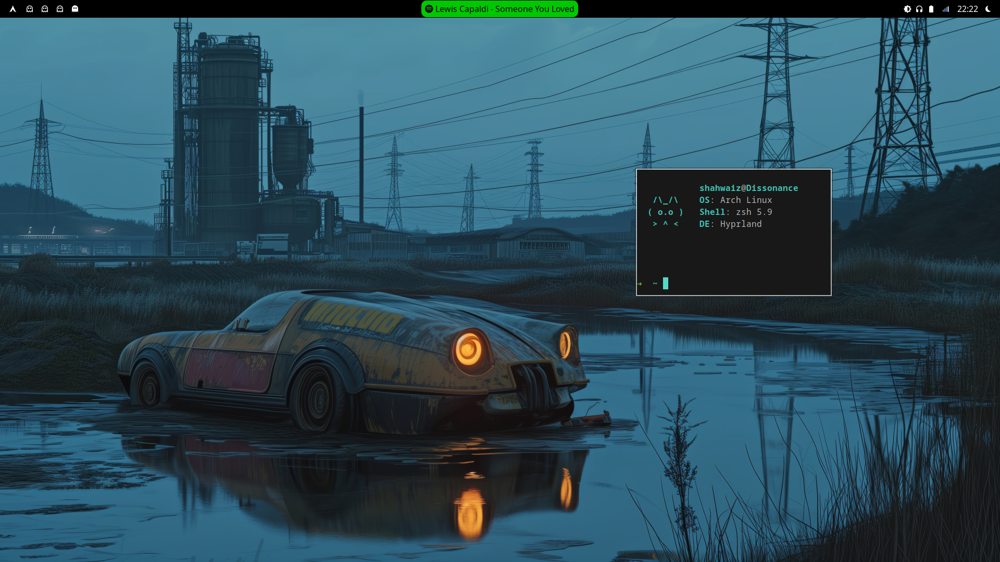

<table>
  <tr>
    <td style="text-align: center;">
      
      
<strong>Style 1 (v2)</strong>

    </td>
    <td style="text-align: center;">
      
      
<strong>Style 2 (v1)</strong>

    </td>
  </tr>
  <tr>
    <td style="text-align: center;">
      
      
<strong>Style 3 (v3)</strong>

    </td>
    <td style="text-align: center;">
      
      
<strong>Experimental Spotify Widget Thingie</strong>

    </td>
  </tr>
</table>    
  
## Setup Details 
Operating system: [Arch Linux](https://archlinux.org/)  
Window manager: [Hyprland](https://github.com/hyprwm/Hyprland)  
Launcher: [Rofi](https://github.com/davatorium/rofi)  
System bar: [Waybar](https://github.com/Alexays/Waybar)  
Terminal: [foot](https://codeberg.org/dnkl/foot)  
GTK3 settings: [nwg-look](https://github.com/nwg-piotr/nwg-look)  
Rofi modules: [adi1090x/rofi](https://github.com/adi1090x/rofi)  
Screenshots: [grim](https://sr.ht/~emersion/grim/)  
Notifications: [dunst](https://github.com/dunst-project/dunst)  
Wallpapers: [waypaper](https://github.com/anufrievroman/waypaper)  
Font: Any Nerd font from [Nerd Fonts](https://www.nerdfonts.com/)  
  
## Custom script for setting wallpaper in Thunar  
`echo %f > /home/shahwaiz/wallpaper && swaybg -i %f -m fill`  
  
## Installation notes  
1- powermenu rofi widgets need [inetutils](https://archlinux.org/packages/core/x86_64/inetutils/) package on arch to show the hostname correctly.  
2- when porting over rofi modules you can't just copy paste the folder you need to re-install the rofi modules by following the installation instructions on the [repo](https://github.com/adi1090x/rofi)  
3- if rofi isn't loading up try using the rofi [wayland fork](https://aur.archlinux.org/packages/rofi-lbonn-wayland)  
  
## Things that are giving me a headache  
making a tool which updates accent color system-wide using the waypaper [post command](https://anufrievroman.gitbook.io/waypaper/configuration) and this script to get the current wallpaper:  
`ps aux |grep swaybg |awk -F ' ' '{print $13;exit;}'` 
 
probably need to find a tool (maybe imagemagick?) which extracts color pallete from an image, so the flow would probably be something like this: 
1- changing the wallpaper in waypaper triggers the post_command, in it we execute a script which: 
2- pipes the current wallpaper to the color pallete extractor. 
3- pipes the color pallete to a script which overwrites the color in the hyprland, waybar, and rofi config files. 
4- profit.
